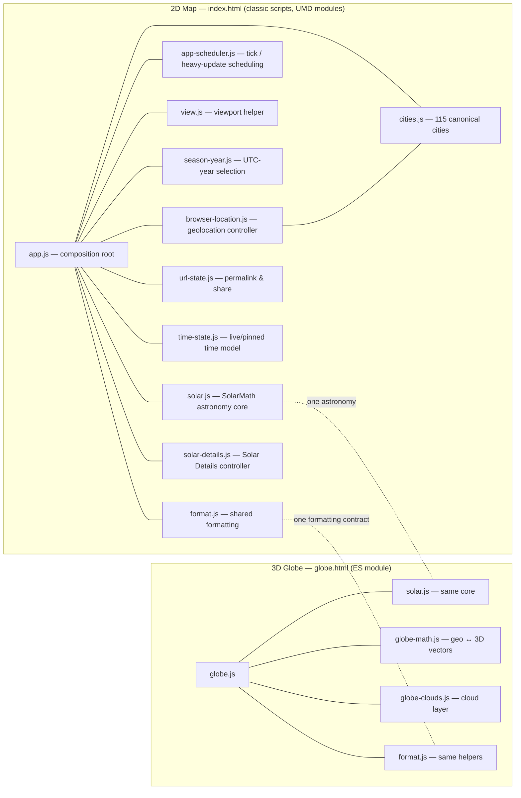
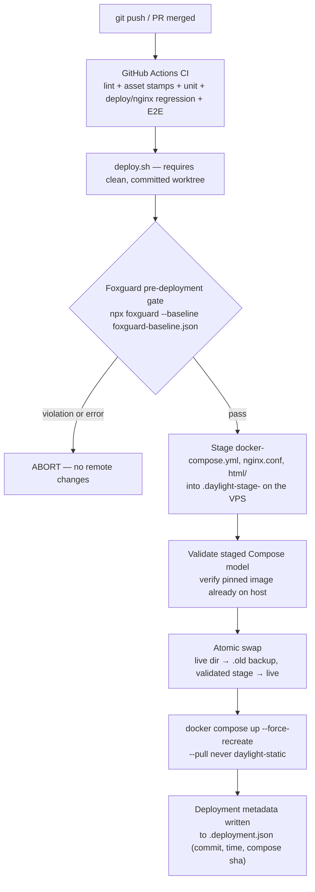

# Daylight Map

A live, interactive clone of the old **daylightmap.org** — a zoomable world map that tracks sunlight, twilight, and darkness as the day progresses.

[](https://daylight.forkstech.com)
[](https://github.com/mbuckingham74/daylight/actions/workflows/ci.yml)
[](https://github.com/mbuckingham74/daylight/commit/3d7da9ac3d92d1d194fe7a197004ab13a4d24151)
[](#license)

## Architecture

Two pages, one astronomy core. The 2D map (`index.html`) is a composition root that wires together small, individually unit-tested UMD modules; the 3D globe (`globe.html`) is an ES module that reuses the same `SolarMath` core, formatting helpers, and `?time=` permalink contract — there is no second astronomy implementation.



## Features

### Visualization
- **Live day/night visualization** with accurate Sun tracking
- **3D Globe** — a photorealistic, interactive Three.js globe on its own page (`globe.html`) that renders the same `SolarMath` day/night state in real time. See [3D Globe](#3d-globe) below.
- **State-aware update scheduler** (`app-scheduler.js`) — the clock display updates every second, but the expensive twilight tile redraw and chart rendering run every ~20 seconds in live mode. Manual interactions (slider, presets, resize, tab switch) render immediately. Work is skipped entirely while the browser tab is hidden and catches up on return.
- **Debounced hover feedback** — map coordinates update instantly on hover, while sunrise/sunset times and chart rebuilds are debounced ~200 ms to avoid redundant SunCalc calls during continuous mouse movement.
- **Smooth twilight gradient** instead of a hard terminator:
  - Civil twilight (sun 0° to −6° altitude)
  - Nautical twilight (sun −6° to −12°)
  - Astronomical twilight (sun −12° to −18°)
  - Night core (sun below −18°)
- **Sun marker** showing where the Sun is directly overhead
- **Twilight legend** — a collapsible legend explaining each color band (daylight, civil, nautical, astronomical, night) and the −0.833° refraction convention used for sunrise/sunset
- **Loading/failure states** — if a required dependency (Leaflet, SunCalc, solar.js, or view.js) fails to load, a non-blocking error banner appears with a reload button instead of a blank page
- **Muted dark terrain-style base map** (Esri World Dark Gray Base + Boundaries & Places overlay) so the terminator stays the star

### Info panel
- **UTC time** — current time (or time-travel time) in UTC
- **Sun Overhead** — coordinates where the Sun is directly overhead, in `NN.NN°N, EEE.EE°E` form
- **Solar Noon at Prime Meridian** — Greenwich solar noon in UTC (illustrates equation of time)
- **Moon Phase** — current lunar phase name
- **Location readout** — sunrise, sunset, and day length, shown in one of three modes:
  - **Hover any point** on the map → sunrise/sunset stay in UTC with the coordinate's local civil time underneath
  - **Click a major city marker** → UTC sunrise/sunset with that city's IANA timezone underneath (e.g. `05:21 PDT` for Seattle, `04:54 BST` for London)
  - **Use My Location** button → centers the map on the browser location at the world overview zoom and copies that location into the map point card
- **Browser location context** — displays the browser's IANA timezone immediately (no permission required). Coordinates are requested only after an explicit click on "Use My Location", which centers the map, shows a blue dot, and fills the nearest major city plus local sunrise/sunset/day length. Coordinates are not persisted or shared unless the user explicitly shares the URL.
- **Solar Details tab** — dense live stats for the current map time:
  - Earth-Sun distance in AU, kilometers, miles, and light travel time
  - Orbital speed, apparent solar diameter, solar energy relative to average, and solar constant estimate
  - Axial tilt, solar declination, right ascension, GMST, equation of time, antisolar point, and next equinox/solstice countdown
  - Selected-point Sun altitude, azimuth, zenith angle, shadow length multiplier, solar-noon altitude, day-length change, and twilight durations
  - Global daylight/twilight/night percentage breakdown
  - Mini charts for annual declination/distance, the current-time analemma, and selected-location day length

### Controls
- **Center Sun** — a one-shot camera action that puts the Sun marker in the center of the map area not covered by the desktop panel or mobile bottom sheet
- **Reset View** — returns to the deterministic world overview and removes shared camera parameters from the address bar
- **Follow Sun** — auto-pans the map to keep the Sun marker centered in the unobstructed map area. Auto-disables on manual pan/zoom, on city click, and on "Use My Location". Defaults *off* so user and shared views are not panned away to the Sun marker.
- **Show twilight** — toggle the twilight/night overlay on/off
- **Major cities** — toggle 15 major world city markers and labels. **Markers are clickable** — clicking a city recenters the map and shows that city's sunrise/sunset in the city's own timezone.

### Time travel
- **Live button** — return to real-time tracking
- **±12-hour slider** — scrubs ±12 hours around the current time-travel anchor (which is either "now" in live mode, or the selected seasonal preset event instant). The slider and presets compose: clicking a preset sets the anchor to the exact event instant, then dragging the slider scrubs around that anchor without jumping back to "now".
- **Preset selection state** — the active solstice/equinox preset is highlighted while that seasonal event instant is shown with no slider offset.
- **Solstice / equinox presets** — jump to the exact calculated instant of the seasonal event (not just the calendar date at an arbitrary time). Events are computed dynamically for the active time-travel year (or the current year when live), so they remain correct across year boundaries and leap years. The active astronomical year is always derived from the displayed instant's **UTC** year (`season-year.js`), never the browser-local calendar year, so the event set cannot drift for viewers in timezones behind or ahead of UTC near the New Year boundary. Hover a preset button to see the exact UTC date and time of the event:
  - March equinox (e.g., 2026-03-20 14:38 UTC)
  - June solstice (e.g., 2026-06-21 08:24 UTC)
  - September equinox (e.g., 2026-09-23 00:17 UTC)
  - December solstice (e.g., 2026-12-21 20:54 UTC)
- **Specific date & time picker** — a `datetime-local` input allows jumping to any date and time in the viewer's local timezone. The UTC equivalent is shown below the input, with a warning if the date is outside the 1900–2100 accuracy range. Works alongside the slider: pick a date to set the anchor, then use the slider for ±12 hour fine-tuning.

### Sharing
- **Share button** — generates a canonical share URL that always includes the current time, map center, and zoom (unlike the address bar, which omits view params on a clean-root session). Uses `navigator.share` when available (mobile), with clipboard copy fallback. Browser geolocation coordinates are never included unless the user explicitly shared a URL that contained them.

### Location
- **Browser geolocation** — calls `navigator.geolocation.getCurrentPosition` only after an explicit click on the "Use My Location" button. Does not request location automatically on load. The button centers the map on the viewer's location at the world overview zoom and populates the local sunrise/sunset card. Explicit shared map views are preserved instead of being overridden by geolocation. Handles permission-denied / unavailable / timeout with inline feedback.
- **Location marker** — shows the browser-reported location as a blue dot on the map. Clicking the dot copies that location into the map point card without requiring a map pan.
- **Nearest city** — computed client-side from geolocation against the same canonical dataset (`cities.js`) that powers the markers — 115 cities worldwide — so no external geocoding service is required.
- **Map point card** — hover/click sunrise and sunset are separate from the browser-location card, so polar hover data cannot be confused with the viewer's local daylight.

### Permalink state
The clean root route always starts from the same world overview; ordinary panning and browser geolocation coordinates are session-only and are not stored. Exact shared views can still be opened with `?time=&lat=&lon=&zoom=`. See [Permalink Format](#permalink-format) below.

## 3D Globe

A separate, directly-accessible page (`globe.html`) renders a photorealistic, interactive 3D Earth using **Three.js 0.160.0** (vendored locally under `html/vendor/`). It reuses **`SolarMath` (solar.js)** — there is no second astronomy implementation. The 2D Leaflet map is untouched and keeps working exactly as before.

### Page and controls
- Reachable via the prominent gold **"3D Globe"** button on the main page's info panel; a reciprocal **"2D Map"** button returns to the map.
- Compact translucent panel: "Daylight Globe" title, live/paused status, current UTC date and time, and **Sun Overhead** coordinates (subsolar point).
- Controls: reset camera, cloud-layer visibility toggle, atmosphere visibility toggle.
- Interaction: pointer drag / touch drag to orbit, wheel / pinch zoom, arrow keys + `+`/`-` when the canvas has keyboard focus, sensible min/max camera distance, subtle presentation auto-rotation that stops on first user interaction and is disabled under `prefers-reduced-motion`.
- The globe starts in live mode and recomputes the solar direction **once per second** (never per frame). An optional `?time=ISO` query parameter (same format as the 2D page) pins the displayed instant — used for deterministic verification and permalinks.
- Performance: pixel ratio capped at 2, correct resize handling, rendering paused while `document.hidden`, no per-frame allocations, and all shader state is updated via uniforms.
- Failure behavior: if WebGL 2, Three.js, a required script, or a required local texture fails, a visible non-blocking error card explains the problem and offers both **"Try again"** (reload) and **"Open 2D Map"** links. A watchdog in `globe.html` catches module-import failures that would otherwise abort silently; slow texture downloads never trigger a failure panel (no arbitrary load timeout), and a successful initialization clears every loading and error state.

### Files
| File | Purpose |
|------|---------|
| `html/globe.html` | Globe page (markup, import map for Three.js, watchdog script) |
| `html/globe-watchdog.js` | Module-failure detection for the watchdog (unit-tested; texture failures excluded) |
| `html/globe.css` | Dark space-oriented styling consistent with the 2D page |
| `html/globe.js` | ES module: scene, shaders, controls, lifecycle, failure states |
| `html/globe-math.js` | Pure geographic ↔ 3D-vector helper (UMD, browser + Node, unit-tested) |
| `html/globe-clouds.js` | Cloud-layer drift and texture configuration (UMD, browser + Node, unit-tested) |
| `html/vendor/three.module.min.js` | Three.js r160 module build (vendored locally, pinned) |
| `html/vendor/addons/controls/OrbitControls.js` | Three.js r160 OrbitControls addon (vendored, pinned) |
| `html/assets/globe/*` | Local NASA Earth textures (see [Attribution](#attribution)) |
| `tests/globe.test.js` | Unit tests for globe-math.js |

### Coordinate convention (single source of truth)
The globe uses a unit sphere with three.js `SphereGeometry` orientation. Mapping geography to object space (east-positive longitude, matching Leaflet and `solar.js`):

```
x = cos(lat) · cos(lng)
y = sin(lat)
z = −cos(lat) · sin(lng)
```

- `+Y` = north pole, `+X` = (0°, 0°) prime meridian, `+Z` = (0°, −90°), `−Z` = (0°, +90°), `−X` = antimeridian.
- Right-handed (X × Y = Z). Texture UVs are three.js defaults: `u = (lng + 180)/360` (seam at the antimeridian), `v = 1 − (lat + 90)/180` (north at top). Standard equirectangular NASA textures map with **no flip** in either axis.
- The Earth mesh is **never rotated**. The camera orbits the fixed globe; the Sun's object-space direction is recomputed from `SolarMath.getSubsolarPoint()` each second and uploaded as a uniform. Presentation auto-rotation moves only the camera, so the continent-to-sunlight relationship is exact at every frame.

### How the shader derives daylight, twilight, and night
Per fragment, `sin(altitude) = dot(surfaceNormal, uSunDir)` — the identical quantity to `SolarMath.getSolarSinAltitude()` on the 2D map. The four thresholds from `SolarMath.TWILIGHT_THRESHOLDS` are passed as a uniform vector:

- **Daylight** — `sin(−0.833°)` (the app's refraction convention). Sunlit day texture, ocean specular (Blinn–Phong, gated by the NASA water mask), and direct sunlight intensity (same smoothing ramp as the band) apply above this threshold, so the visible day/night boundary sits exactly on the documented apparent horizon. Smoothing is symmetric around the threshold, so the geographic boundary is exact. There is no direct light at or below the boundary — the bluish surface tint below it is atmospheric (scattered) light, kept separate so the night side never brightens.
- **Civil / nautical / astronomical twilight** — `sin(−6°)`, `sin(−12°)`, `sin(−18°)`. The surface color shifts from sunlit texture toward a deep twilight blue between the daylight and astronomical thresholds (`twilightDepth`), so the terminator reads atmospheric and continuous without moving any boundary.
- **Night** — below −18°. City lights fade in naturally as altitude falls (a smoothstep centered on the astronomical threshold, fully visible ~3.5° deeper) and are **only** on the dark side; night-side clouds stay near-black.

Lighting, tone mapping (ACES fitted curve) and the sRGB transfer function are implemented inline in the shaders; sRGB-tagged textures are uploaded as sRGB textures so sampling yields linear values. There is no ambient light washing out the night side.

### Verification
`tests/globe.test.js` locks the convention against cardinal cases (equator, poles, ±90°, antimeridian), unit length, invalid input, and — most importantly — cross-checks `GlobeMath` against `SolarMath.getSolarSinAltitude()` over a lat/lng grid at the four 2026 seasonal events (March equinox, June solstice, September equinox, December solstice), including the −0.833° refraction terminator placement.

## Tech Stack

| Layer | Tool |
|-------|------|
| Mapping | [Leaflet](https://leafletjs.com/) 1.9.4 |
| 3D rendering | [Three.js](https://threejs.org/) r160 (vendored locally, pinned; MIT) |
| Solar position (subsolar + twilight) | Self-contained first-principles algorithm (low-precision solar position + GMST + geodesic spherical caps), extracted into `html/solar.js` for unit testing |
| Auxiliary solar/lunar data | [SunCalc](https://github.com/mourner/suncalc) 1.9.0 — used only for Greenwich solar noon, moon phase, and hover sunrise/sunset/day-length |
| Timezone lookup | [tz-lookup](https://github.com/darkskyapp/tz-lookup-oss) 6.1.25 — maps arbitrary lat/lng points to IANA timezones for local civil time |
| Base map | Esri World Dark Gray Base + Boundaries & Places |
| Hosting | Static nginx container behind Nginx Proxy Manager |
| Deployment | Docker Compose on a VPS |

> **Note on time display:** The map point card keeps UTC as the primary sunrise/sunset time and adds the selected point's local civil time underneath when a timezone can be resolved. Major city markers use their hardcoded IANA timezones, arbitrary points use `tz-lookup`, and the browser-location card uses the browser's local timezone. Day length is timezone-independent and always correct.

## Astronomy

The subsolar point and twilight boundaries are computed from first principles — **not** from SunCalc — using:

- Low-precision solar position algorithm (mean longitude, mean anomaly, ecliptic longitude, obliquity)
- Greenwich Mean Sidereal Time (GMST)
- Equatorial → subsolar transform: `latitude = declination`, `longitude = RA − GMST` (east-positive)
- Geodesic spherical caps centered on the **antisolar point** (the antipode of the subsolar point), with angular radius `90° + solar_altitude`
- Earth-Sun distance from mean anomaly, plus derived light time, orbital speed, apparent solar diameter, solar irradiance ratio, and equation of time
- Dynamic equinox/solstice countdowns found by numerically refining declination zero-crossings and extrema

### Accuracy envelope

The algorithms are low-precision but sufficient for visualization. The supported date range (where Daylight computes) is **1900–2100**; the "accuracy" column records what independent reference comparisons actually observe — a sampled envelope, not a guaranteed full-range maximum. `tests/solar-position-reference.test.js` and `tests/seasons-reference.test.js` enforce these envelopes as regression bounds.

| Quantity | Supported range | Observed accuracy (reference sample) | Source |
|----------|----------------|--------------------------------------|--------|
| Subsolar latitude (declination) | 1900–2100 | within 0.01°; observed ≤0.005° in 33 USNO/JPL cases spanning 1900–2100 | Meeus ch. 25; USNO celnav + JPL Horizons |
| Subsolar longitude (RA − GMST) | 1900–2100 | within 0.01°; observed ≤0.008° in 27 USNO cases (1900–2050), RA component ≤0.006° at the 2100 edge (GMST itself ≤0.0005°) | IERS 1996 GMST; USNO celnav/siderealtime + JPL Horizons |
| Earth-Sun distance | 1900–2100 | within ~1×10⁻⁴ AU; observed ≤8.4×10⁻⁵ AU in 15 JPL cases | Meeus ch. 25 (truncated series) |
| Equation of time | 1900–2100 | within 0.1 minutes; observed ≤0.05 minutes in 27 USNO-derived cases | Meeus ch. 28 |
| Equinox/solstice times | 1900–2100 | typically within ~10 minutes; worst observed ~15 minutes in the sampled USNO reference set | Meeus ch. 25 (0.01° model) |
| Sunrise/sunset (SunCalc) | 1900–2100 | typically within ~1–2 minutes at sampled mid-latitudes; held within 3 minutes in the 24-case USNO regression set | SunCalc / refraction model |
| Twilight thresholds | Any | Exact (defined by altitude angle) | Standard definitions |

Seasonal-event instants are found by numerically refining the model's
declination zero-crossings and extrema; that refinement is exact to well
under a second, so the event-time uncertainty is the same ~0.01° envelope as
the solar longitude itself. `tests/seasons-reference.test.js` compares all
four events in ten years spanning 1900–2100 against US Naval Observatory
reference instants (typically within ~7 minutes, worst observed ~15 minutes
in that sample — a sampled observation, not a guaranteed full-range
maximum), and the regression bounds enforce that envelope.

The sunrise/sunset times shown on the map come from SunCalc (see the
[Tech Stack](#tech-stack)), not from the model above.
`tests/sunrise-sunset-reference.test.js` regresses the production SunCalc
1.9.0 path against US Naval Observatory sunrise/sunset times for
twenty-four deterministic cases — Seattle, Sydney, and Singapore at the
four 2026 seasonal-event dates, plus June 21 in 1950, 2000, 2050, and
2100 (five sampled years) — covering northern and southern mid-latitudes
and the near-equatorial zone across the seasons. The USNO values are
published to whole-minute precision in UTC; Daylight's SunCalc output is
held within 3 minutes of each published instant, the observed worst
deviation in this sample (~2.3 minutes) plus the reference's ±30 s
rounding. Typical observed agreement is ~1–2 minutes, which is the
accuracy stated in the table above; the ±3-minute bound is the regression
tolerance for these sampled cases, not a global 1900–2100 guarantee.

The solar-position model itself (subsolar point, twilight boundaries,
orbital distance, equation of time) is validated by
`tests/solar-position-reference.test.js`: 27 instants spanning 1900–2050
against USNO "Celestial Navigation" (apparent geocentric solar declination
and Greenwich hour angle) and "Sidereal Time" (GMST) services, plus the
2080/2100 range edge against JPL Horizons (DE441) apparent solar right
ascension/declination and Earth-Sun distance, where the USNO services
stop. The references are independent of Daylight's Meeus-based model and
far exceed its precision; the regression tolerances are the envelopes in
the table above (0.01°, 1×10⁻⁴ AU, 0.1 minutes). Note that the USNO/JPL
values are apparent positions (aberration and nutation included) while
Daylight's model is geometric mean-of-date; that bounded convention
difference (≈0.005–0.008°) is included in the observed envelopes.

Outside the 1900–2100 range, the obliquity and eccentricity formulas accumulate larger errors. Dates far outside this range should not be relied upon for precise solar positions.

The math is verified against standard solstice/equinox values:

| Event | Subsolar Latitude | Verified |
|-------|-------------------|----------|
| March equinox 2026 | 0.00° | ✓ |
| June solstice 2026 | +23.44° | ✓ |
| September equinox 2026 | −0.03° | ✓ |
| December solstice 2026 | −23.44° | ✓ |

Unit tests (run with `npm test`) verify declination bounds across multiple years, solar-position accuracy against USNO/JPL references, sunrise/sunset tolerance against USNO references, polar day/night, antimeridian wrapping, leap day handling, and URL parameter validation.

### Longitude convention

Longitudes are **east-positive** throughout, matching both Leaflet and SunCalc:
- Seattle is `lng: -122.3`
- Tokyo is `lng: 139.65`
- Subsolar longitude is computed as `RA − GMST` and wrapped to `[−180, 180)` via a sign-safe modulo (`((x + 540) % 360) − 180`) so values near the antimeridian never come out as e.g. `−186°` instead of `+174°`.
- Hover longitude is wrapped via the fully sign-safe `(((x + 180) % 360 + 360) % 360) − 180` because Leaflet's `latlng.lng` can be unbounded when `worldCopyJump: true`.

## Project Structure

```
.
├── html/
│   ├── index.html            # Main 2D map page (loads the UMD modules below)
│   ├── app.js                # 2D composition root: wires the modules together
│   ├── solar.js              # Pure solar/astronomy math (UMD, Node-testable)
│   ├── app-scheduler.js      # 1 Hz tick + heavy-update rate limiting (UMD)
│   ├── view.js               # 2D viewport helper (UMD)
│   ├── season-year.js        # UTC-year selection for seasonal events (UMD)
│   ├── cities.js             # Canonical city dataset: markers + nearest-city (UMD)
│   ├── format.js             # Shared formatting primitives (UMD)
│   ├── url-state.js          # Permalink/share URL handling (UMD)
│   ├── time-state.js         # Canonical live/pinned time model (UMD)
│   ├── browser-location.js   # "Use My Location" controller (UMD)
│   ├── solar-details.js      # Solar Details tab controller (UMD)
│   ├── globe.html            # 3D globe page (ES module entry, import map)
│   ├── globe.js              # 3D globe app (ES module)
│   ├── globe-math.js         # Geographic ↔ 3D vector conversion (UMD)
│   ├── globe-clouds.js       # Cloud-layer drift/texture config (UMD)
│   ├── globe-watchdog.js     # Globe module-failure detection (unit-tested)
│   ├── style.css / globe.css # Page styling
│   ├── favicon.svg           # Site icon
│   ├── vendor/               # Three.js r160 + OrbitControls (pinned, MIT)
│   └── assets/globe/         # Local NASA Earth textures (see Attribution)
├── tests/
│   ├── solar.test.js         # Solar math unit tests (node:test runner)
│   ├── globe.test.js         # globe-math + globe-clouds unit tests
│   ├── presets.test.js       # Seasonal preset and year-boundary tests
│   ├── view.test.js          # Viewport helper tests
│   ├── edge-cases.test.js    # Permalink/edge-case tests
│   ├── url-state.test.js     # URL serialization tests
│   ├── time-state.test.js    # Live/pinned state model tests
│   ├── season-year.test.js   # UTC-year selection tests
│   ├── scheduler.test.js     # Update-scheduling tests
│   ├── format.test.js        # Formatting-contract tests
│   ├── cities.test.js        # Canonical city dataset tests
│   ├── city-coverage.test.js # Nearest-city geographic coverage tests
│   ├── browser-location.test.js # Geolocation subsystem tests
│   ├── solar-details.test.js # Solar Details panel tests
│   ├── cloud-wrap.test.js    # Globe cloud texture wrapping tests
│   ├── asset-versions.test.js# ?v= stamp drift tests
│   ├── watchdog.test.js      # Globe watchdog tests
│   ├── solar-position-reference.test.js  # USNO/JPL reference regression
│   ├── seasons-reference.test.js         # Equinox/solstice reference regression
│   ├── sunrise-sunset-reference.test.js  # SunCalc vs USNO regression
│   ├── e2e/                  # Playwright browser smoke suite (2D + globe)
│   ├── deploy.test.sh        # deploy.sh control-flow regression (mocked ssh)
│   └── nginx-headers.test.sh # nginx.conf header/routing regression
├── scripts/asset-versions.js # Enforce content-hashed ?v= asset stamps
├── docker-compose.yml        # nginx static container with healthcheck
├── nginx.conf                # gzip, caching, security headers, CSP Report-Only
├── deploy.sh                 # One-command deploy to the VPS (Foxguard-gated)
├── foxguard-baseline.json    # Foxguard pre-deployment gate baseline
├── playwright.config.js      # E2E config (Chromium, local static server)
├── package.json              # Dev tooling (ESLint, tests, E2E)
├── eslint.config.js          # ESLint 9 flat config (module override for globe.js)
├── .github/workflows/ci.yml  # GitHub Actions: check + E2E jobs on push/PR
├── BACKLOG.md                # Issue/backlog tracking
├── README.md                 # This file
└── .gitignore
```

## Local Development

You can serve the `html/` directory with any static file server:

```bash
# Python
python3 -m http.server 8000 --directory html

# Node
npx serve html
```

Then open http://localhost:8000 for the 2D map and http://localhost:8000/globe.html for the 3D globe. Both pages work from the same static server with no build step. For deterministic globe states during development, append `?time=2026-06-21T08:24:00Z` (any ISO 8601 UTC instant).

### Testing and Linting

The project has no build step, but includes development-only tooling:

```bash
npm install            # install dev tooling (ESLint, Playwright)
npm run lint           # run ESLint on JS files
npm run check:assets   # verify every ?v= asset stamp matches file contents
npm run update:assets  # rewrite ?v= stamps (run after changing any asset)
npm test               # run unit tests (Node built-in test runner)
npm run test:e2e       # run the Playwright browser smoke suite (Chromium)
npm run check          # run lint + check:assets + tests
```

E2E runs the real `html/` origin through a minimal local static server
(`tests/e2e/static-server.js`) in Chromium, fetching CDN dependencies
(Leaflet, SunCalc, tz-lookup, Esri tiles) exactly as production does — it
exercises app wiring, DOM, geolocation, share, and dependency-failure states
without waiting on tile traffic. Two additional regression suites are shell
scripts run from CI, not `npm run check`:

- `tests/deploy.test.sh` — runs the real `deploy.sh` against mocked
  `ssh`/`rsync`/`docker`/`npx`, covering first/repeat deployment, staged
  Compose validation failures, stale-staging recovery, and Foxguard gate
  ordering (the gate must run before any remote mutation and fail closed).
- `tests/nginx-headers.test.sh` — boots the exact pinned nginx image with
  the real `nginx.conf` and asserts response headers and routing: security
  headers on every caching location, true 404s for unknown routes (no SPA
  fallback), no immutable cache on missing assets, and `/csp-report` handled
  as a discarded POST (204) and rejected GET (405).

## Deployment

The site runs as an `nginx:alpine` container on `forkstech.com` and is exposed through Nginx Proxy Manager. The currently running production build is commit `3d7da9a`, recorded in `.deployment.json` on the host.

To deploy from this repo:

```bash
./deploy.sh
```



The script:
1. Requires a clean, committed worktree, runs the mandatory Foxguard pre-deployment gate (`npx foxguard --baseline foxguard-baseline.json .`), and stages `docker-compose.yml`, `nginx.conf`, and `html/` under `/home/michael/deployments/` on ForksTech. Nothing on the server is touched unless Foxguard passes
2. Validates the staged Compose model, atomically swaps it into place at `/home/michael/deployments/daylight/` (previous deployment kept aside as a backup until the swap succeeds), and records the exact source commit in `.deployment.json`
3. Recreates only `daylight-static` with `--force-recreate` (the atomic directory swap changes the bind-mount inode, so recreation is mandatory) and `--pull never` (the pinned image identity is never silently changed)

The nginx configuration (`nginx.conf`) provides:
- Gzip compression for CSS, JS, JSON, and SVG
- Long-term caching for versioned assets (files with `?v=` query params), including the local globe textures (`png/jpg/jpeg/webp`)
- Content-hashed `?v=` stamps enforced by `scripts/asset-versions.js` (`npm run check:assets` in CI), so a changed asset can never ship without its version bump
- `no-cache` revalidation for `index.html` and `globe.html`
- Security headers (X-Frame-Options, X-Content-Type-Options, Referrer-Policy, Permissions-Policy) re-declared on every location that sets its own `Cache-Control`, because nginx `add_header` does not inherit across such locations
- CSP in Report-Only mode (move to enforcement after reviewing violations); reports are POSTed to `/csp-report`, which is deliberately discarded (204) with GETs rejected (405)
- True 404s for unknown extensionless routes (no SPA fallback) and for missing asset files (never cached as immutable)
- Container healthcheck via `wget --spider`

### CI

GitHub Actions runs two jobs on every push and pull request. The **check** job runs ESLint, `check:assets`, `bash -n deploy.sh`, the `deploy.test.sh` and `nginx-headers.test.sh` regression suites, and all unit tests. The **e2e** job installs Chromium and runs the Playwright smoke suite, uploading failure artifacts from `test-results/`. See `.github/workflows/ci.yml`.

## Permalink Format

```
https://daylight.forkstech.com/?time=2026-12-22T02:56:24.000Z&lat=47.6000&lon=-122.3000&zoom=4
```

| Param | Description |
|-------|-------------|
| `time` | ISO 8601 UTC timestamp. Omit for live mode. |
| `lat`  | Map center latitude. `0` is honored (not treated as missing). |
| `lon`  | Map center longitude (east-positive). `0` is honored (not treated as missing). |
| `zoom` | Leaflet zoom level (2–12). |

The globe page accepts the same `?time=` parameter (e.g. `globe.html?time=2026-06-21T08:24:00Z`) to pin the displayed instant; omit it for live mode.

The **Follow Sun** control starts *off* so shared and first-load views are preserved instead of being immediately panned away to the Sun marker. Normal browsing keeps the address bar clean; map coordinates stay in the URL only when the page was opened as an explicit map view. **Reset View** returns to the canonical root camera and removes those view parameters.

## Known Limitations

- **Sun marker** uses the nearest wrapped world copy to stay visually continuous across the antimeridian. The displayed coordinate remains normalized to `[−180, 180]`.
- **Geolocation requires HTTPS and user permission.** On `http://` (e.g. local dev without TLS) or if the user denies the prompt, the button reports the error inline.

## Attribution

All globe textures are NASA imagery (public domain). Day/night texture provenance and the exact source files are recorded in `html/assets/globe/ATTRIBUTION.md`.

| Asset | Source | License / status |
|-------|--------|------------------|
| `day.jpg` — Blue Marble albedo | NASA Blue Marble imagery, redistributed via the [three-globe](https://github.com/vasturiano/three-globe) example assets (MIT repository) | Public domain (NASA) |
| `night.png` — city lights | NASA Black Marble 2016 (VIIRS) composite, stitched from NASA GIBS WMTS tiles (`VIIRS_Black_Marble`, 2016-01-01) | Public domain (NASA) |
| `bump.jpg` — shaded relief + bathymetry | NASA Blue Marble imagery, stitched from NASA GIBS WMTS tiles (`BlueMarble_ShadedRelief_Bathymetry`) | Public domain (NASA) |
| `specular.jpg` — land/ocean mask | NASA Blue Marble water mask, redistributed via the [three.js](https://github.com/mrdoob/three.js) examples (MIT repository) | Public domain (NASA) |
| `clouds.png` — cloud cover | NASA Terra MODIS cloud composite, redistributed via the three.js examples (MIT repository) | Public domain (NASA) |
| `three.module.min.js`, `OrbitControls.js` | [three.js](https://github.com/mrdoob/three.js) r160 | MIT |

The star background is procedural (generated in `globe.js`), so it needs no attribution.

NASA imagery courtesy of the [NASA Earth Observatory](https://earthobservatory.nasa.gov) and the [Global Imagery Browse Services (GIBS)](https://earthdata.nasa.gov/eosdis/gibs).

## License

MIT
